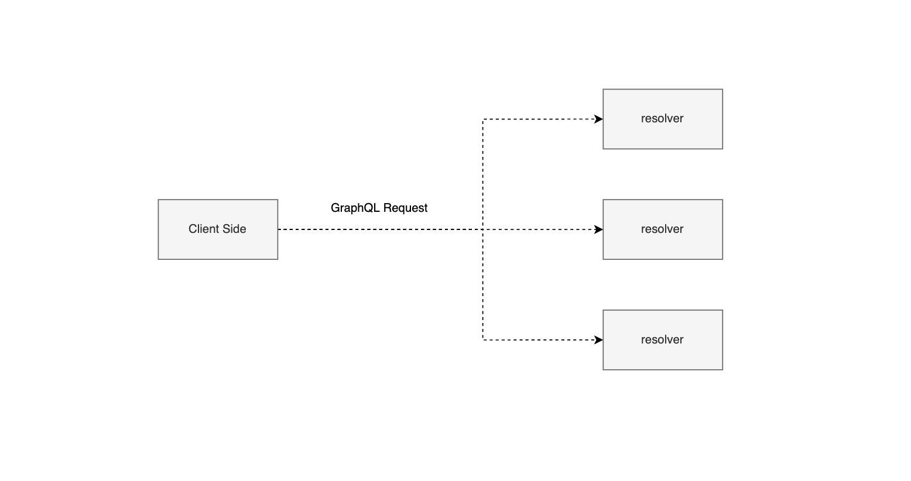

Resolvers in Orionjs are the controllers or main functions to execute routines, query the database and return data with defined structures.

These are divided into two large groups of resolvers, the resolvers of the application and the resolvers of models.

In the case of the resolvers of the application are generally defined to return data with the structures of the database, and the resolvers of models return dynamic information, generally not defined in the schemas of the application.

## Application Resolver

Resolvers of the application are responsible for handling incoming requests and returning responses to the client.



### The structure of the main resolvers of the application

```
app
└── components
    ├── ExampleComponent
    │   └── resolvers
    │       ├── resolver1
    │       │   └── index.ts
    │       ├── resolver2
    │       │   └── index.ts
    │       └── index.ts
    └── resolvers.ts
```

- `ExampleComponent`: The directory that groups a context.
- Folder `resolvers`: The directory of the set of resolvers.
- File `resolvers.ts`: File containing the list of resolvers exposed to the client using graphql.
- `resolver1` & `resolver2`: Function to execute routines, query the database and return data with defined structures.

:::info
The **routing** mechanism is self-managed by name as you **export default** in the main `index.ts` file in the resolvers folder. For example, if you want to make a query when `resolver1` and the server is running ([http://localhost:3000/graphiql](http://localhost:3000/graphiql)), you can send a request through GraphQL as follows:

```graphql
{
  resolver1
}
```

:::

### Example of the `resolvers.ts`

```ts
import ExampleComponent from './ExampleComponent/resolvers'

export default {
  ...ExampleComponent
}
```

### Example of the resolvers directory `index.ts`

```ts
import resolver1 from './resolver1'
import resolver2 from './resolver2'

export default {
  resolver1,
  resolver2
}
```

## Resolver types

### Basic resolver

Basic resolvers are controllers that can receive parameters and use them for a specific calculation, or to make a GraphQL Query to the database to return an element with its defined schema or of some other specific type.

```js
import {resolver} from '@orion-js/resolvers'

export default resolver({
  params: {
    parameter1: {
      type: String
    }
  },
  returns: String,
  async resolve(params, viewer) {
    return `Hello world, ${params.parameter1}`
  }
})
```

#### Cache

You can add cache policy to your resolvers by adding a `cache` property specifying a number of milliseconds:

`cache: 1000 * 60 * 60, // Cache 1 hour in milliseconds`

example:

```ts
import {resolver} from '@orion-js/resolvers'

const ONE_HOUR_MILLISECONDS = 3600000

export default resolver({
  cache: ONE_HOUR_MILLISECONDS,
  params: {},
  returns: String,
  async resolve(params, viewer) {
    return `Hello Cached`
  }
})
```

#### Permissions

You can check if the user perfoming the query or mutation has permission (or any condition) adding a `checkPermission` function to the resolver configuration object.

- This function receives the resolvers `parameters` and the `current viwer`, an object representing the user executing this resolver, as parameters.
- If the user does not have permission or the condition you check is not valid, you should throw an error.

```js
  ...
  checkPermission (params, viewer) {
  // Check permissions or any condition here.
  // Throw an error if viewer is not allowed or conditions are not met.
  },
  ...
```

### Paginated resolver

:::info
Paginated resolver, required install `@orion-js/paginated-mongodb` package

```cli
yarn add @orion-js/paginated-mongodb
```

:::

paginatedResolvers are used to get MongoDB cursors for a GraphQL Query, into a paginated list. Notice the `async getCursor()` function with respect to the `async resolve()` function in the [`basicResolver`](resolvers.md#basic-resolver).

```js
import {paginatedResolver} from '@orion-js/paginated-mongodb'
import Example from 'app/components/ExampleComponent/models/Example'
import Examples from 'app/components/ExampleComponent/collections/Examples'

export default paginatedResolver({
  params: {},
  returns: Example,
  async getCursor(params, viewer) {
    return Examples.find()
  }
})
```

`paginatedResolvers` also can receive parameters like in `resolver`:

```ts
import {paginatedResolver} from '@orion-js/paginated-mongodb'
import Example from 'app/components/ExampleComponent/models/Example'
import Examples from 'app/components/ExampleComponent/collections/Examples'

export default paginatedResolver({
  params: {
    parameter1: {
      type: String
    }
  },
  returns: Example,
  async getCursor({parameter1}, viewer) {
    return Examples.find(parameter1)
  }
})
```

### Mutation resolver

Mutations are used to perform GraphQL mutations to create, update or delete documents of a collection over the database. notice the `mutation: true` property, which is used to make the distintion for different modules to use, like [`Autoform`](https://orionjs.com/docs/autoform)

```js
import {resolver} from '@orion-js/app'
import Examples from 'app/collections/Examples'
import Example from 'app/models/Example'

export default resolver({
  params: {
    parameter1: {
      type: String
    },
    parameter2: {
      type: String
    }
  },
  returns: Boolean,
  mutation: true,
  async resolve({parameter1, parameter2}, viewer) {
    const example = await Examples.findOne(parameter1)
    await example.update({$set: {parameter2: parameter2}})
    return true
  }
})
```

### Crud resolver

`crudResolvers` have the peculiarity of be called from `CRUD`, a React Component created for the [Orionjs fullstack Boilerplate](https://github.com/orionjs/boilerplate-graphql-fullstack).

#### React App

```js
import React from 'react'
import Crud from 'App/components/Crud'

export default class Examples extends React.Component {
  static propTypes = {}

  getListFields() {
    return [
      {title: 'Field 1', name: 'field1'},
      {title: 'Field 2', name: 'field2'}
    ]
  }

  render() {
    return (
      <div className={styles.container}>
        <br />
        <Crud
          path="/examples"
          singular="Example"
          plural="Examples"
          allowSearch
          listFields={this.getListFields()}
        />
      </div>
    )
  }
}
```

#### Orionjs Resolver

```js
import {crudResolvers} from '@orion-js/app'
import Examples from 'app/collections/Examples'

export default {
  ...crudResolvers({
    collection: Examples,
    paginatedOptions: {
      async getCursor({field3}, viewer) {
        return Examples.find({field3})
      },
      params: {
        field3: {
          type: String,
          optional: true
        }
      }
    }
  })
}
```

---

## Model resolver

The resolvers of the model are responsible for returning data in a dynamic way, generally not defined in the application schemas.

To learn about Model resolvers, refer to [`Model resolvers`](models.md#resolvers)
